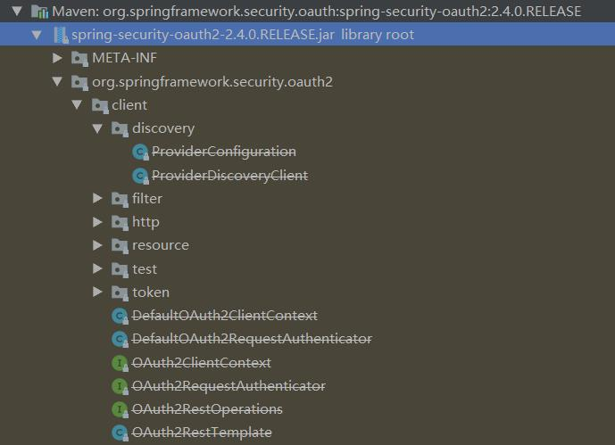

## 简介

Spring-Security-OAuth2是对OAuth2的一种实现，并且跟我们之前学习的Spring Security相辅相成，与Spring Cloud体系的集成也非常便利，接下来，我们需要对它进行学习，最终使用它来**实现我们设计的分布式认证授权解决方案**。

   也就是以下都是用SpringCloud来实现项目的搭建，学习分布式下的Spring Security OAuth2.0，其实在分一个单独的服务下仍然使用的还是SpringBoot；

   OAuth2.0的服务提供方共涵盖两个服务，即**授权服务** (Authorization Server，也叫认证服务) 和**资源服务** (Resource Server)，使用 Spring Security OAuth2 的时候你可以选择把它们在同一个应用程序中实现，也可以选择建立使用 同一个授权服务的多个资源服务。

**授权服务 (Authorization Server）**应包含对接入端以及登入用户的合法性进行验证并颁发token等功能，对令牌的请求端点由 Spring MVC 控制器进行实现，下面是配置一个认证服务必须要实现的endpoints： 

- AuthorizationEndpoint 服务于认证请求。默认     URL： /oauth/authorize 。 
- TokenEndpoint 服务于访问令牌的请求。默认 URL：     /oauth/token 。 

TokenEndpoint 负责颁发、访问令牌，而AuthorizationEndpoint是对请求的身份进行校验。如果用户身份不合法就不会颁发令牌，所以AuthorizationEndpoint校验后才会响应TokenEndpoint 。

**资源服务 (Resource Server)**，应包含对资源的保护功能，对非法请求进行拦截，对请求中token进行解析鉴 权等，下面的过滤器用于实现 OAuth 2.0 资源服务： 

- OAuth2AuthenticationProcessingFilter用来对请求给出的**身份令牌解析鉴权**。

本教程分别创建**uaa授权服务**（也可叫认证服务）和**order订单资源服务**。

认证流程如下：

1、客户端请求UAA授权服务进行认证。

2、认证通过后由UAA颁发令牌。

3、客户端携带令牌Token请求资源服务。

4、资源服务校验令牌的合法性，合法即返回资源信息。

uaa负责发放token用户认证和验证token，order服务是订单服务，对访问订单的请求进行token的校验，对order进行简化不涉及查数据库操作；

注意：父工程依赖中，使用的SpringSecurityOAuth2已经很老了，已经被弃用：

最新的依赖是：

https://github.com/spring-projects/spring-security/tree/master/oauth2

本项目使用的还是老版本的，在后来熟悉OAuth2.0后，进行替代；

## 项目

项目整体基于Spring Cloud，单个微服务基于Spring Boot；

| 序号 |      项目名      | token在内存/数据库 |    对应资源服务    | JWT  |
| :--: | :--------------: | :----------------: | :----------------: | :--: |
|  1   | springcloud_uaa  |        内存        | springcloud_order  |  否  |
|  2   | springcloud_uaa2 |   JWT（不存储）    | springcloud_order2 |  是  |
|  3   |    分布式项目    |        JWT         |     分布式项目     |  是  |

- 第一个项目，springcloud_uaa是基于内存实现的，即客户端信息（生成的token）保存到内存中，对客户端的校验不需要从数据库中查询，这个项目支持四种访问模式，只是一个入门的项目；
- 第二个项目，springcloud_uaa2使用JWT实现token，此时授权服务器不需要存储令牌，令牌中存储着用户的所有信息，资源服务器不需要对客户端的每一个请求都要去验证令牌，使用了JWT，只需资源服务器本身验证令牌合法性即可，不需要再远程连接授权服务进行验证；
- 第三个项目，distributed_discovery + distributed_gateway + distributed_ + distributed_ 实现分布式的微服务Spring Security OAuth2.0认证协议，协议使用distributed_discovery作为服务注册发现中心，基于eureka的配置注册中心，distributed_gateway是网关。