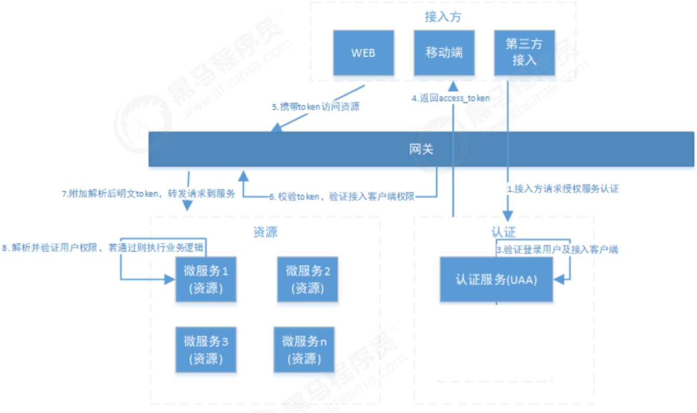

## 简介

网关服务。技术基于eureka；

1、UAA认证服务负责认证授权，发放token。 

2、所有请求经过网关到达微服务。

3、网关负责鉴权客户端以及请求转发。客户端携带着token访问由网关拦截到，然后对token进行信息，获得授权的信息，网关对客户端的权限进行校验，客户端的权限就是Token中的scope，还需要校验的有：客户端Id,客户端密钥等。

4、网关将token解析后传给微服务，微服务进行授权。详细流程是：网关校验通过以后，网关将token解析为明文，发送给各微服务那么各微服务就不必再解析了，只需要将token明文放到Spring Security的上下文中，那么在微服务中就可以随意使用了。

如果网关想要把请求信息转发给各微服务，那么各微服务就需要在注册中心中注册，