   通过前面的过程，授权服务已经过内存读取客户端信息的方式搭建完成，现在开始搭建资源服务，它就是类似于微信的资源服务器，通过**授权服务器向客户端颁发了令牌以后，客户端使用令牌向资源服务访问用户的信息**。或者说当某一个授权服务授权后，客户端使用令牌访问其他的服务（不固定为微信授权的场景）；资源服务器**完成对令牌的校验和提供资源**；

**1、资源服务器配置**

   1、新建一个配置类：ResouceServerConfig.java，加上配置类注解：@Configuration。

   2、将@EnableResourceServer 注解到这个新建的类 @Configuration 配置类上，并且必须使用 ResourceServerConfigurer 这个配置对象来进行配置这个新建类（也可以选择继承自 ResourceServerConfigurerAdapter ，然后覆写其中的方法，参数就是这个对象的实例）。

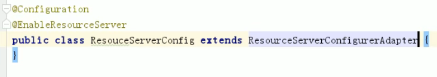

下面是一些可以配置的属性：

ResourceServerSecurityConfigurer中主要包括：

- **tokenServices**：ResourceServerTokenServices     类的实例，用来实现令牌服务。 
- **tokenStore**：TokenStore类的实例，指定令牌如何访问，与tokenServices配置可选     
- **resourceId**：这个**资源服务的ID**，这个属性是可选的，但是推荐设置并在授权服务中进行验证。 
- **其他的拓展属性。**例如 tokenExtractor     令牌提取器用来提取请求中的令牌。

这个资源服务的ID就是我们再授权服务中给某一个客户端设置的这个客户端允许访问到的资源服务。比如我们给C1客户端配置res1，那么我们建立一个资源服务，就可以给它配置resourceId为res1,此时C1就可以访问它；

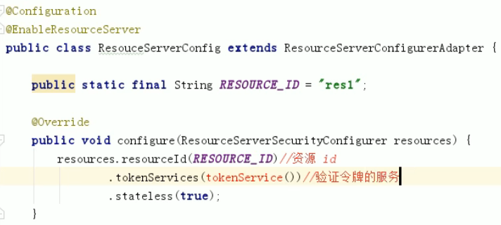

配置如上；stateless(true)代表无状态暂时未知；

   **3****、配置资源服务的安全安全访问策略**

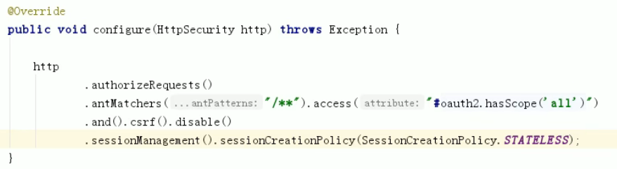

HttpSecurity配置这个与Spring Security类似：

- 请求匹配器，用来设置需要进行保护的资源路径，默认的情况下是保护资源服务的全部路径，即设置/**。这个权限access()，是根据oauth2中定义的客户端的scope来匹配一致决定的，这里定义的是all,那么如果客户端不是all就不能访问。如C1定义的就是all说明可以访问；
- 通过http.authorizeRequests()来设置受保护资源的访问规则。
- 因为我们是基于token的方式，所以这里：sessionManagement().sessionCreationPolicy (SessionCreationPolicy.STATELESS); 就是关闭session的记录方式。
- 其他的自定义权限保护规则通过 HttpSecurity     来进行配置。

@EnableResourceServer 注解自动增加了一个类型为 OAuth2AuthenticationProcessingFilter 的过滤器链编写ResouceServerConfig。

这三个过程总体图，第三行为开启方法授权模式的注解，因为下面需要用到方法授权：

 

**2、配置验证token**

   ResourceServerTokenServices 是组成授权服务的另一半，如果你的授权服务和资源服务在同一个应用程序上的话，你可以使用 DefaultTokenServices ，这样的话，你就不用考虑关于实现所有必要的接口的一致性问题。如果你的资源服务器是分离开的，那么你就必须要确保能够有匹配授权服务提供的 ResourceServerTokenServices，它知道如何对令牌进行解码。

 

   令牌解析方法： 

- **资源服务和授权服务在一个工程中时**，可以使用 DefaultTokenServices 在资源服务器本地配置令牌存储、解码、解析方式。
- **通常资源服务和授权不在同一工程下时**，可以使用 RemoteTokenServices 资源服务器通过 HTTP 请求来解码令牌，每次都请求授权服务器端点     /oauth/check_token。

 

   1、使用授权服务的 /oauth/check_token 端点你需要在授权服务将这个端点暴露出去，以便资源服务可以进行访问， 这在咱们授权服务配置中（前几节中）已经配置过了，即我们在授权服务中配置了/oauth/check_token 和 /oauth/token_key 这两个端点：

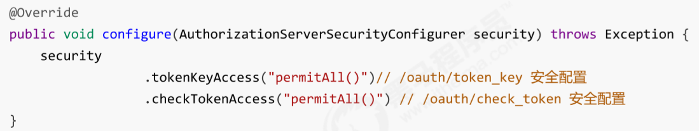

2、接下来，在资源服务配置RemoteTokenServices ，在ResouceServerConfig中配置：

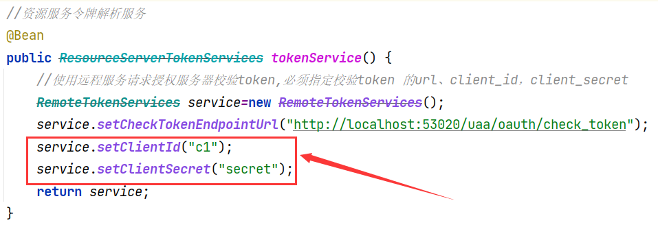

配置资源服务远程校验令牌的URL和被校验者的id和密钥；（这两个信息不应该是从读取客户端发来的数据里读取的吗？？？？？？？？？不是很明白）

解答：客户端通常就只会带着token去资源服务请求资源，但是资源服务器想要验证客户端发来的token信息，是不需要带着客户端的client_id和client_secret的，因为资源服务器将token发送给授权服务器验证，授权服务器会将这个token的申请信息发送给资源服务器，包括：拥有这个token的客户端id、客户端访问范围、用户的权限、用户名等。这时资源服务器可以通过查询数据库或者配置文件读取到客户端的信息，得到是否有一个这样的客户端id在本地（资源服务器）配置过，如果有就允许访问资源该用户对应权限的资源；也就是资源服务器只会验证这个token是否是有效的，并且这个token的拥有者是否是已经在资源服务器中备案过即可；

**测试：**

**1****、客户端模式的**

我们使用我们之前生成的令牌，通过这个url进行Postman测试。

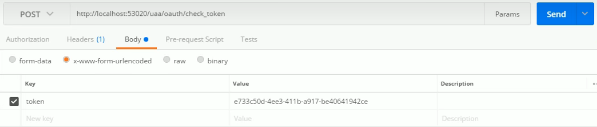

参数token使用我们上次生成的客户端模式下的token。发送send：

验证的结果就是允许的资源id为res1，范围为all，客户端id为c1;

**2****、用户名密码模式的**

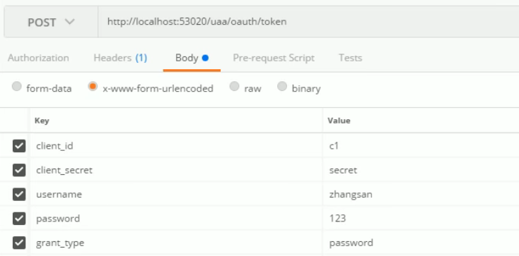

发送给授权服务，授权服务器生成了token发回给我们：

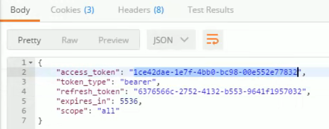

使用这个令牌去校验：

校验的结果包括，这个客户端允许访问的资源ID，已经这个token是为哪一个用户申请的，这个用户在这整个授权服务器和资源服务器所拥有的权限，以及拥有这个token的客户端id；

其他模式和这两个差不多。不再一一尝试了。

 

**3、编写资源**

在controller包下编写OrderController，此controller表示订单资源的访问类：

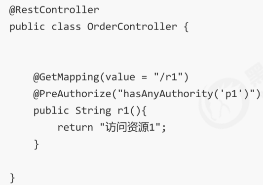

使用基于方式授权资源的访问控制模式。（此处配好下面第四步就不需要配了）

此时启动整个资源服务项目，进行尝试访问：

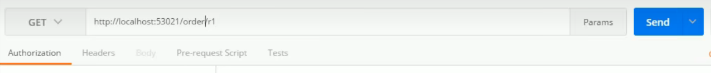

返回结果：

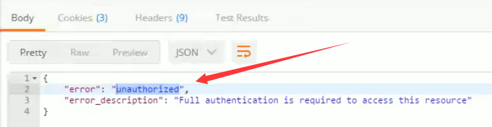

提示没有被授权，授权后才可以访问。所以我们需要先申请令牌。

**4、添加安全访问控制** **（必须配）**

我们在上面配置了基于方法授权的模式，这里就不需要配对资源的访问控制，只需要简单配一下对其他资源的访问控制就可以，这个配置不就是SpringSecurity的配置嘛；

  **如果不配这个会怎么样呢？**

  如果我们不配这个拦截机制，也可以通过前面已经配好的方法授权进行相应资源的拦截，配这个主要是为了更方便Spring Security管理。

 

**5、测试**

**1、申请令牌**

这里我们使用密码方式

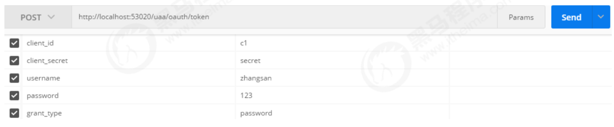

响应结果为：

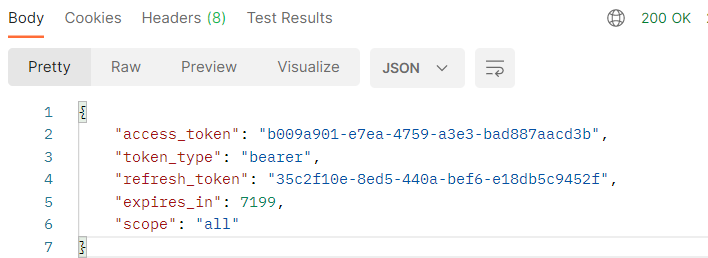

**2、请求允许的资源**

按照oauth2.0协议要求，客户端请求资源需要携带token，格式如下：

资源服务的地址+允许的资源 (这里是r1) + Headers头部

Headers头部必须写上，token的参数名称为：**Authorization**，值为：Bearer token值。

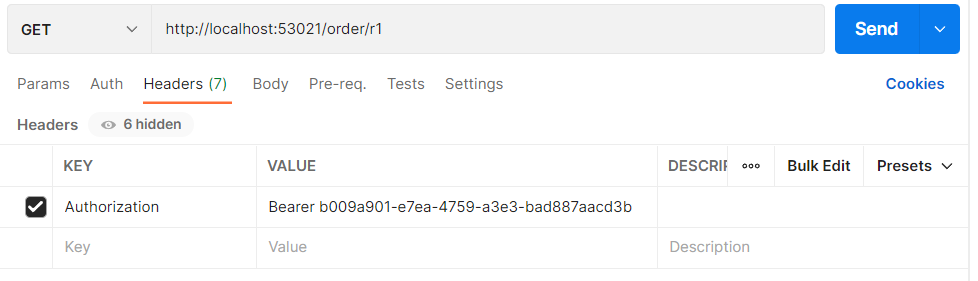

客户端使用用户zhangsan的token想要访问的资源：

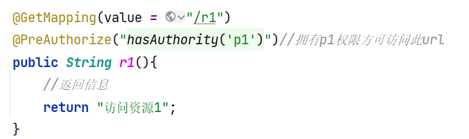

得到访问的相应：

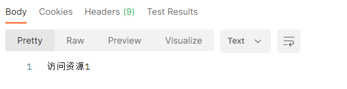

因为这个token是由用户zhangsan账户申请的，它拥有的权限是p1。所以可以访问。

如果使用错误的token访问：

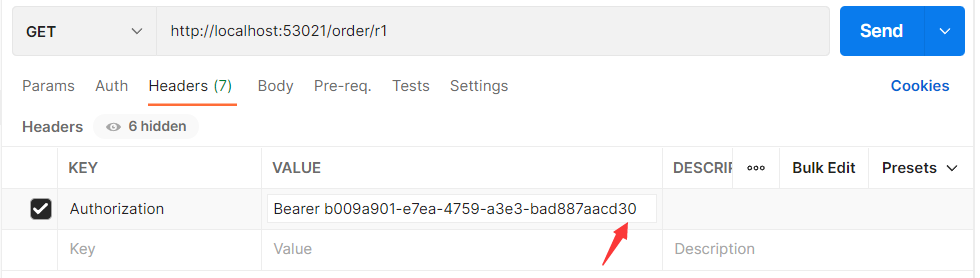

返回的结果：

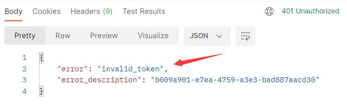

**3、请求非法资源**

如果客户端访问在zhangsan账户允许访问的权限以外的资源呢？

**第一种情况**：假设我们没有配置《添加安全访问控制》中的安全拦截机制，因为在某一个配置类中开启了方法授权的注解：

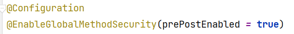

所以对于受@PreAuthorize保护的资源，仍然需要相应的权限：

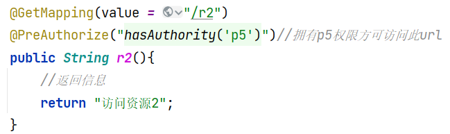

这个资源需要p5的权限才可以访问，zhangsan只有p1的权限想要访问的话：

使用token访问结果：

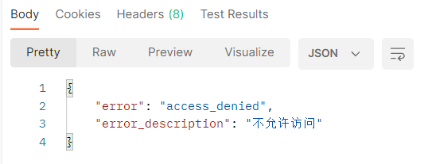

就会因为权限问题不可以访问；

说明了我们使用方法授权的方式时，不配置Spring Security的安全拦截机制也是可以的。

**第二种情况**：我们配置了安全拦截机制，并且也使用方法授权的机制；

开启这个注解：

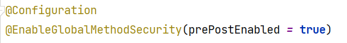

在Controller中配置方法授权：

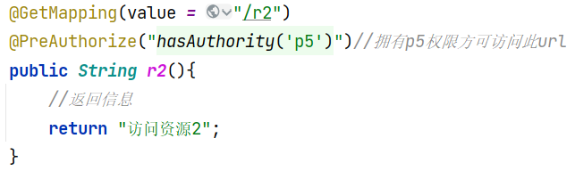

此时访问的话就为：

说明方法授权和拦截机制并不冲突；建议同时使用更方便。

**第三种情况**：在第二种情况的基础上，关闭对方法授权的开启，测试是否可以允许客户端使用用户zhangsan的token访问zhangsan允许范围外的其他资源。

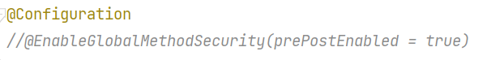

访问被拒绝：

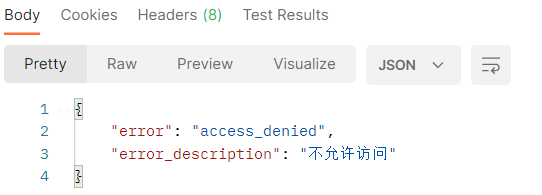

说明：当我们配置了以方法授权进行拦截时，如果我们没有在某一个配置类上开启这个注解，但是配置Spring Security的安全拦截机制上配置了http等拦截选项，就仍然出发这个注解的拦截机制。

此时token是保存在内存中（或者数据库中，只是授权项目没有实现），这个资源服务每次接收到客户端的访问请求都要去授权服务器去验证，对于高并发的请求不太适用；如果能够实现减少资源服务每次对token向授权服务器校验就可以很好的节约资源，那怎么保证安全性呢？使用JWT可以携带着客户端的信息，并且还可以定义有效期，有效期内不必每次请求都校验；

对应项目：springcloud_order,和它搭配的项目时springcloud_uaa;